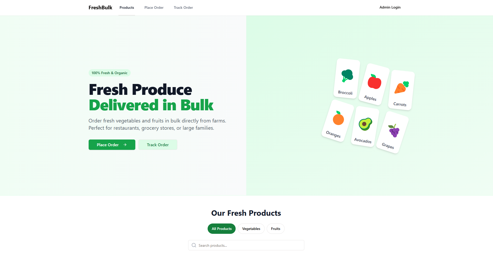
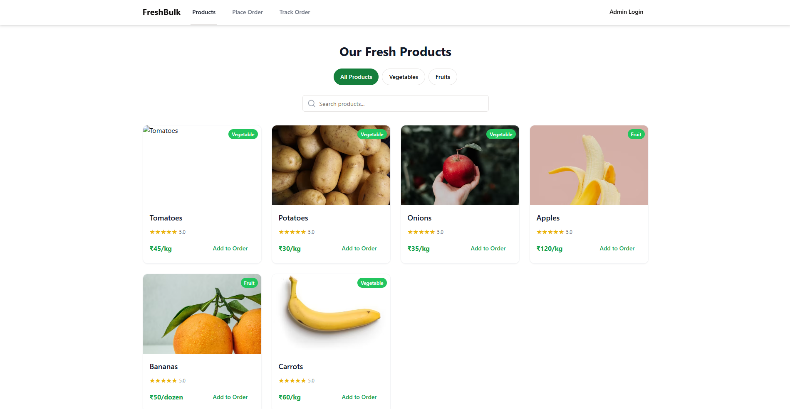
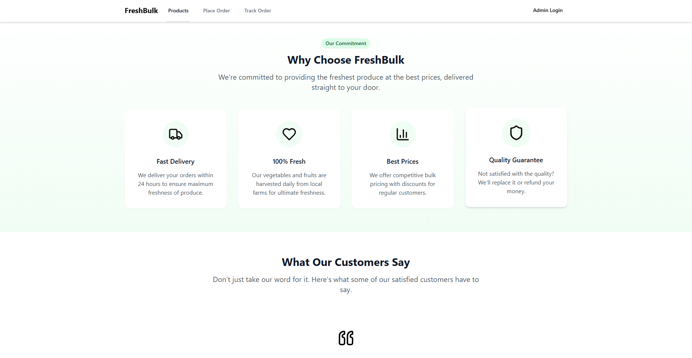
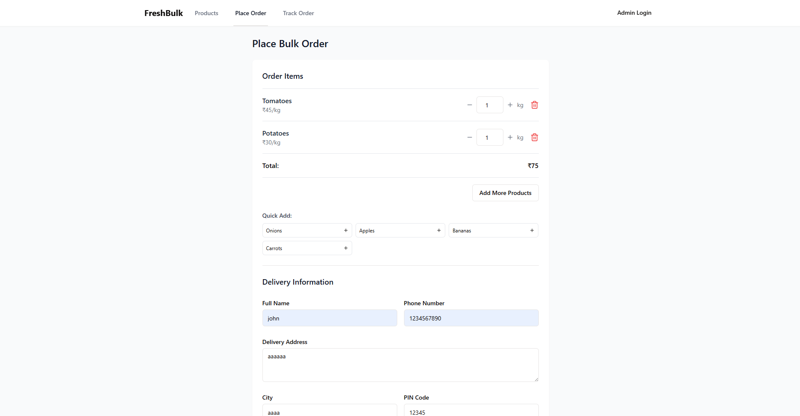
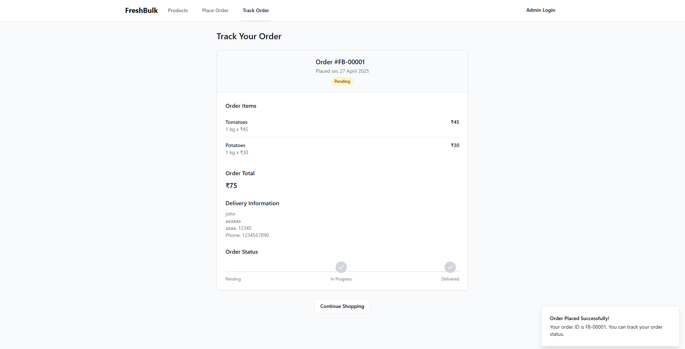
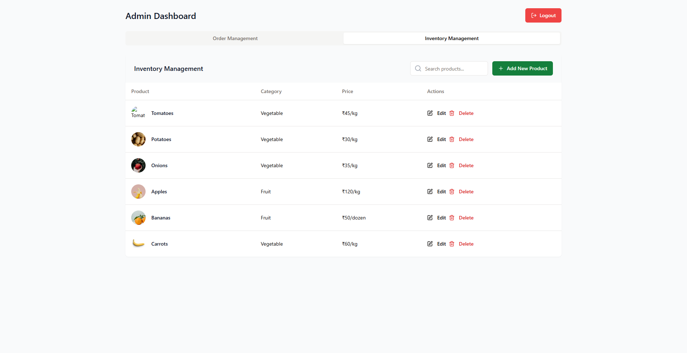
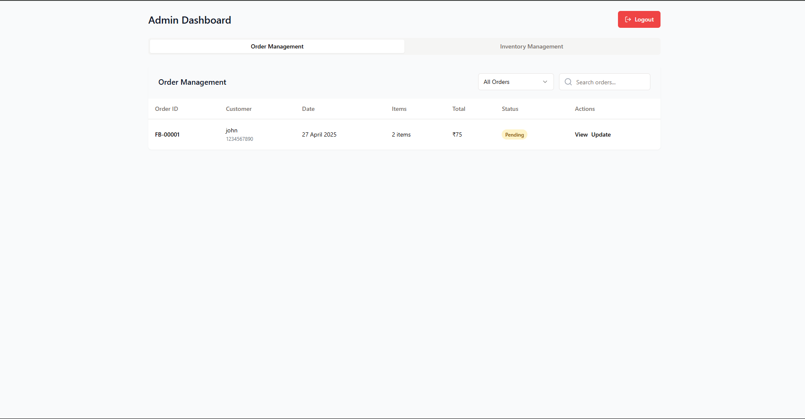

# 🥦 FreshBulk - Bulk Vegetable & Fruit Ordering Platform

FreshBulk is a full-stack web application that allows customers to order fresh vegetables and fruits in bulk directly from farms. The platform is designed for restaurants, grocery stores, and large families to easily place and track bulk produce orders.

.
.
.
.
.
.
.
## 🚀 Features

### Customer Features
- **Product Catalog**: Browse through a variety of fresh vegetables and fruits
- **Category Filtering**: Filter products by category (All, Vegetables, Fruits)
- **Search Functionality**: Search for specific products by name or category
- **Shopping Cart**: Add products to cart and manage quantities
- **Order Placement**: Place bulk orders with delivery details
- **Order Tracking**: Track order status through a unique order ID

### Admin Features
- **Secure Admin Login**: Protected admin dashboard with authentication
- **Order Management**: View all orders with customer details
- **Order Status Updates**: Update order status from Pending → In Progress → Delivered
- **Inventory Management**: Add, edit, and remove products from the catalog
- **Product Analytics**: View product performance and sales metrics (coming soon)

## 🛠️ Technology Stack

### Frontend
- **React**: UI library for building the user interface
- **TypeScript/JavaScript**: Programming language
- **Tailwind CSS**: Utility-first CSS framework for styling
- **shadcn/ui**: High-quality UI components
- **TanStack Query**: Data fetching and state management
- **Wouter**: Lightweight routing solution
- **Zod**: Schema validation

### Backend
- **Node.js**: JavaScript runtime
- **Express**: Web application framework
- **In-memory Storage**: Fast data storage (upgradable to PostgreSQL)
- **Session Management**: Express-session with MemoryStore
- **API**: RESTful API design

## 🔄 API Endpoints

### Products API
- `GET /api/products` - Get all products
- `GET /api/products/:id` - Get product by ID
- `POST /api/products` - Create a new product (admin only)
- `PUT /api/products/:id` - Update a product (admin only)
- `DELETE /api/products/:id` - Delete a product (admin only)

### Orders API
- `GET /api/orders` - Get all orders (admin only)
- `GET /api/orders/:orderId` - Get a specific order
- `POST /api/orders` - Place a new order
- `PUT /api/orders/:orderId/status` - Update order status (admin only)

### Admin API
- `POST /api/admin/login` - Admin login
- `POST /api/admin/logout` - Admin logout
- `GET /api/admin/session` - Check admin session status

